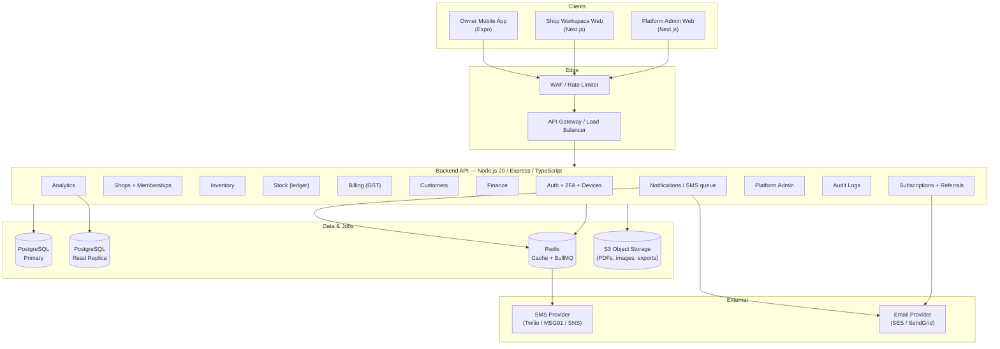
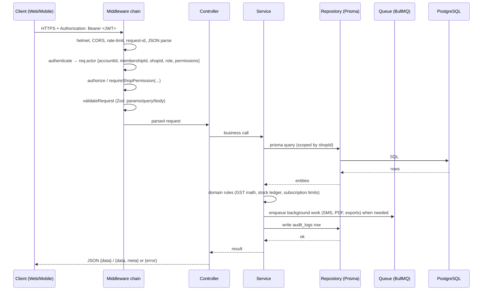
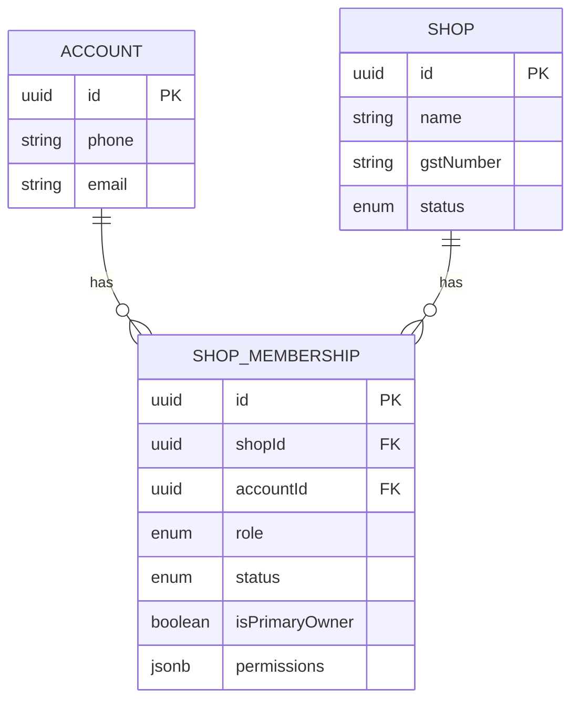
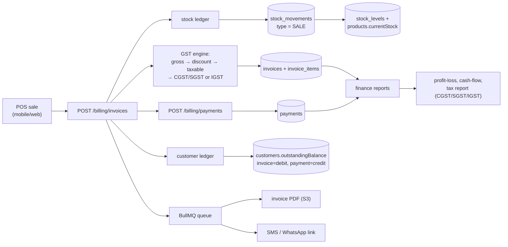

# Architecture

## 1. System overview

RaghuMayaShop is a **multi-tenant SaaS platform** that lets shop owners run their whole business from one place: product catalog, stock, GST invoices, customers & due collection, finance, and analytics. Platform admins run the SaaS business itself: tenant shops, users, subscriptions, approvals, support, and audit.

The backend is a **modular monolith**: one Express service, strict module boundaries (`routes → controller → service → repository`), versioned REST API (`/api/v1`). PostgreSQL is the system of record; Redis powers cache and BullMQ background jobs; S3-compatible storage holds invoice PDFs, product images, and export files.

## 2. Component diagram

**Web and mobile talk to the same REST API.** There is no separate admin API process; platform admins call `/api/v1/admin/*` with an admin-scoped token, shop users call the shop endpoints with a membership-scoped token (`activeShopId` claim).

## 3. Backend module breakdown

`apps/api/src/modules/<name>/` — each module owns:

| File | Responsibility |
|---|---|
| `*.routes.ts` | Route registration: auth middleware, permission guards, Zod validation |
| `*.controller.ts` | HTTP only: parse input, call service, format response |
| `*.service.ts` | Business logic: GST math, stock ledger, subscription rules |
| `*.repository.ts` | Prisma data access; tenant scoping enforced here |
| `*.validation.ts` | Zod schemas for body/query/params |

Shared cross-cutting code lives in `src/common/`: `authenticate`, `authorize` (RBAC), `requireShopPermission`, `audit` writer, `idempotency`, `rateLimit`, `errorHandler`, `requestLogger`, Prisma client, Redis/BullMQ setup, SMS/email adapters, S3 client.

Modules and their domain:

- **auth** — login, register, OTP, email/SMS verification, password reset, 2FA, devices, admin creation
- **shops** — create/list/update shops, switch active shop, memberships (invite/update/remove)
- **inventory** — categories, brands, products, variants, batches, images, barcode/QR lookup
- **stock** — warehouses, ledger movements, transfers, alerts, recalculate
- **purchases** — supplier purchases (header + items), auto stock-in
- **billing** — invoices, GST engine, payments, PDF, share tokens, SMS/WhatsApp links
- **customers** — profiles, ledger, history, due payments, reminders
- **finance** — categories, revenues, expenses, assets, liabilities, reports
- **analytics** — shop KPI dashboards and breakdowns (read-replica friendly)
- **subscriptions** — plans, shop subscription lifecycle, limits/features checks, admin assignment
- **referrals** — codes, tracking, conversion, rewards, coupons
- **notifications** — in-app notifications, SMS logs, retry
- **audit** — audit log search + dashboard
- **admin** — platform dashboard, shops, users, subscriptions, approvals, support tickets, reports/exports, settings, security
- **health** — `/health/live`, `/health/ready`

## 4. Request lifecycle

Every business repository method takes the actor's `shopId` — tenant isolation is enforced in the data layer, never trusted from client input.

## 5. Multi-tenancy model

- One **account** (global login identity) can hold **memberships** in many shops.
- Each shop request carries the token's **`activeShopId`** claim. The `requireShopPermission` middleware re-loads the membership (`accountId + shopId`, `status = ACTIVE`) and resolves effective permissions: `OWNER` gets `["*"]`; others get role defaults merged with per-membership overrides.
- Switching shops: `POST /api/v1/shops/switch {shopId}` verifies an ACTIVE membership exists, then issues a fresh access + refresh token pair scoped to that shop.
- Platform admins are separate identities (`admins` table, `AdminRole`): `SUPER_ADMIN, ADMIN, SUPPORT_EXECUTIVE, FINANCE_MANAGER, READ_ONLY_AUDITOR`, each with permission keys like `shops.read`, `approvals.approve`. They never carry `activeShopId`; admin endpoints check `actorType = ADMIN` + permission keys.
- Legacy note: an older `shop_users` model existed; identity now lives in `accounts` + `shop_memberships` (see DATABASE.md).

## 6. Data flow: sale → invoice → stock → finance

Key invariants:

1. **Ledger-first stock**: `stock_movements` rows are immutable; quantities are derived. The `recalculate` endpoint can rebuild derived state from the ledger.
2. **Customer ledger**: outstanding balance = Σ(invoice totals) − Σ(payments). Running balance per entry for the detail view.
3. **Invoice immutability**: issued invoices are edited only via PATCH with audit; financial records use reversals, not deletion.
4. **Audit**: each of these steps writes an `audit_logs` row with actor, action, entity, shop, old/new values, IP.

## 7. Background jobs (BullMQ)

| Queue | Jobs |
|---|---|
| `sms` | invoice-link SMS, due-payment reminders, shop-created credentials |
| `pdf` | invoice PDF generation → upload to S3, store `pdfUrl` |
| `exports` | async report exports (PDF/Excel/CSV) → S3 with expiring download URL |
| `notifications` | in-app + email/push fan-out |
| `analytics` | heavy aggregation rollups |

In production, workers run as a **separate service** from the API (see DEPLOYMENT.md) so scaled API replicas never double-execute jobs.

## 8. Scaling posture

- Phase 1 (this release): modular monolith, one Postgres primary, Redis for cache/queues, async jobs for SMS/PDF/exports.
- Phase 2: read replicas for analytics/admin dashboards, Redis caching of dashboard aggregates (30–120 s TTL), materialized daily summary tables, cursor pagination on large lists.
- Phase 3: split only high-throughput modules (notifications, analytics, billing) into services; partition hot tables (`audit_logs`, `stock_movements`, `invoices`) by month; optional OpenSearch for heavy product/customer search.
