# Database

PostgreSQL is the system of record. Prisma is the ORM; migrations live in `apps/api/prisma/`.

## 1. ER overview

```mermaid
erDiagram
    ACCOUNTS ||--o{ SHOP_MEMBERSHIPS : "memberships"
    SHOPS ||--o{ SHOP_MEMBERSHIPS : "members"
    ADMINS ||--o{ REFRESH_TOKENS : "sessions"
    ACCOUNTS ||--o{ REFRESH_TOKENS : "sessions"
    ACCOUNTS ||--o{ DEVICES : "devices"
    ACCOUNTS ||--|| TWO_FACTOR_SETTINGS : "2fa"

    SHOPS ||--o{ CATEGORIES : "has"
    SHOPS ||--o{ BRANDS : "has"
    CATEGORIES ||--o{ PRODUCTS : "products"
    BRANDS ||--o{ PRODUCTS : "products"
    PRODUCTS ||--o{ PRODUCT_IMAGES : "images"
    PRODUCTS ||--o{ PRODUCT_VARIANTS : "variants"
    PRODUCTS ||--o{ PRODUCT_BATCHES : "batches"

    SHOPS ||--o{ WAREHOUSES : "warehouses"
    WAREHOUSES ||--o{ STOCK_LEVELS : "levels"
    PRODUCTS ||--o{ STOCK_LEVELS : "levels"
    SHOPS ||--o{ STOCK_MOVEMENTS : "ledger"
    STOCK_TRANSFERS ||--o{ STOCK_TRANSFER_ITEMS : "items"

    SHOPS ||--o{ SUPPLIERS : "suppliers"
    PURCHASES ||--o{ PURCHASE_ITEMS : "items"

    SHOPS ||--o{ CUSTOMERS : "customers"
    CUSTOMERS ||--o{ INVOICES : "invoices"
    INVOICES ||--o{ INVOICE_ITEMS : "items"
    INVOICES ||--o{ PAYMENTS : "payments"
    INVOICES ||--o{ INVOICE_SHARE_TOKENS : "share links"
    CUSTOMERS ||--o{ CUSTOMER_REMINDERS : "reminders"

    SHOPS ||--o{ ORDERS : "orders"
    ORDERS ||--o{ ORDER_ITEMS : "items"

    SHOPS ||--o{ REVENUES : "revenues"
    SHOPS ||--o{ EXPENSES : "expenses"
    SHOPS ||--o{ ASSETS : "assets"
    SHOPS ||--o{ LIABILITIES : "liabilities"
    SHOPS ||--o{ FINANCE_CATEGORIES : "categories"

    SUBSCRIPTION_PLANS ||--o{ SUBSCRIPTIONS : "periods"
    SHOPS ||--o{ SUBSCRIPTIONS : "subscriptions"
    SHOPS ||--o{ REFERRAL_CODES : "codes"
    REFERRAL_CODES ||--o{ REFERRALS : "leads"

    SHOPS ||--o{ NOTIFICATIONS : "notifications"
    SHOPS ||--o{ SMS_LOGS : "sms"
    SHOPS ||--o{ AUDIT_LOGS : "audit"
```

## 2. Conventions

- **Money**: `Decimal(14,2)` (quantities `Decimal(14,3)`); serialized as **string** in JSON. Never float.
- **IDs**: UUID v4 (`gen_random_uuid()`).
- **Timestamps**: `createdAt`, `updatedAt`, `deletedAt` (soft delete; business entities filter `deletedAt IS NULL`).
- **Tenancy**: every business table has `shopId`; repositories scope on it.
- **Tokens/secrets**: refresh tokens hashed; TOTP secrets encrypted; backup codes SHA-256; OTP codes hashed with attempts/expiry.

## 3. Table dictionary

### Identity & sessions

| Table | Purpose | Key columns |
|---|---|---|
| `accounts` | Global login identity (shop owners & staff) | `id`, `fullName`, `email` (unique), `phone` (unique), `passwordHash`, `status` (AccountStatus), `emailVerifiedAt`, `phoneVerifiedAt`, `lastLoginAt` |
| `admins` | Platform admin identity | `id`, `fullName`, `email` (unique), `passwordHash`, `role` (AdminRole: SUPER_ADMIN, ADMIN, SUPPORT_EXECUTIVE, FINANCE_MANAGER, READ_ONLY_AUDITOR), `status`, `emailVerifiedAt`, `phoneVerifiedAt`, `lastLoginAt` |
| `shops` | Tenant business | `id`, `name`, `legalName`, `gstNumber`, `phone`, `email`, address fields, `status` (ACTIVE/SUSPENDED/BLOCKED/…), `subscriptionStatus` |
| `shop_memberships` | Account ↔ shop access | `id`, `shopId`, `accountId` (unique pair), `role` (UserRole), `status` (MembershipStatus: ACTIVE/PENDING/SUSPENDED/BLOCKED), `isPrimaryOwner`, `permissions` (jsonb overrides), `invitedById`, `joinedAt`, `lastAccessedAt` |
| `devices` | Device fingerprints | `id`, `accountId`/`adminId`, `deviceHash` (SHA-256 of device headers), `deviceName`, `deviceType`, `platform`, `verifiedAt`, `revokedAt` |
| `refresh_tokens` | Hashed rotating refresh tokens | `id`, `actorType` (ADMIN/SHOP_USER), `accountId`/`adminId`, `deviceId`, `tokenHash`, `expiresAt`, `revokedAt` |
| `password_reset_tokens` | Hashed reset tokens | `id`, `accountId`/`adminId`, `tokenHash`, `expiresAt`, `usedAt` |
| `verification_tokens` | Hashed OTP codes (login, email, SMS) | `id`, `accountId`, `purpose`, `channel`, `codeHash`, `attempts`, `expiresAt`, `consumedAt` |
| `two_factor_settings` | TOTP per account/admin | `id`, `accountId`/`adminId`, `totpSecret` (encrypted), `methods` (jsonb), backup codes (SHA-256), `enabledAt` |
| `user_profile_changes` | Profile change requests pending admin approval | `id`, `accountId`, `shopId`, `requestedChanges` (jsonb), `status`, `reviewedById`, `reviewedAt`, `rejectionReason` |

### Catalog

| Table | Purpose | Key columns |
|---|---|---|
| `categories` | Nested product categories per shop | `id`, `shopId`, `name`, `parentId` (self), `sortOrder` |
| `brands` | Product brands per shop | `id`, `shopId`, `name` |
| `products` | Product master | `id`, `shopId`, `categoryId`, `brandId`, `name`, `sku`, `barcode`, `qrCode`, `description`, `unit`, `purchasePrice`, `sellingPrice`, `taxRate`, `currentStock`, `reorderLevel`, `imageUrl`, `isActive`; unique `(shopId,sku)`, `(shopId,barcode)`, `(shopId,qrCode)` |
| `product_images` | Product gallery | `id`, `productId`, `url`, `isPrimary`, `sortOrder` |
| `product_variants` | Variants (size/color…) | `id`, `productId`, `name`, `sku`, `barcode`, `qrCode`, `attributes` (jsonb), price overrides, `currentStock`; unique `(productId,sku)`, `(productId,barcode)`, `(productId,qrCode)` |
| `product_batches` | Batch inventory with expiry | `id`, `shopId`, `productId`, `variantId` (nullable), `batchNumber`, `manufacturedDate`, `expiryDate`, `quantity`, `purchasePrice`; unique `(shopId,productId,variantId,batchNumber)`; index `(shopId,expiryDate)` |

### Stock (ledger-first)

| Table | Purpose | Key columns |
|---|---|---|
| `warehouses` | Storage locations per shop | `id`, `shopId`, `name`, `code`, `address`, `isDefault` |
| `stock_levels` | Derived current qty per warehouse×product×variant×batch | `id`, `shopId`, `warehouseId`, `productId`, `variantId`, `batchId`, `quantity`, `reservedQuantity` |
| `stock_movements` | **Immutable** stock ledger | `id`, `shopId`, `warehouseId`, `productId`, `variantId`, `batchId`, `movementType` (IN/OUT/TRANSFER_IN/TRANSFER_OUT/ADJUSTMENT/PURCHASE/SALE), `quantity`, `unitCost`, `referenceType`, `referenceId`, `note`, `createdById` |
| `stock_transfers` | Transfer header | `id`, `shopId`, `fromWarehouseId`, `toWarehouseId`, `status`, `note`, `createdById` |
| `stock_transfer_items` | Transfer lines | `id`, `transferId`, `productId`, `variantId`, `batchId`, `quantity` |
| `suppliers` | Purchase suppliers | `id`, `shopId`, `name`, `phone`, `email`, `address`, `gstNumber` |
| `purchases` | Purchase header | `id`, `shopId`, `supplierId`, `purchaseNumber`, `purchaseDate`, totals, `status` |
| `purchase_items` | Purchase lines | `id`, `purchaseId`, `productId`, `variantId`, `batchNumber`, `expiryDate`, `quantity`, `unitCost`, totals |

### Sales & customers

| Table | Purpose | Key columns |
|---|---|---|
| `customers` | Customer master | `id`, `shopId`, `name`, `phone`, `email`, `address`, `gstNumber`, `creditLimit`, `outstandingBalance` |
| `customer_reminders` | Reminder history | `id`, `shopId`, `customerId`, `channel` (SMS/WHATSAPP), `recipient`, `message`, `invoiceLink`, `status` |
| `orders` | Orders | `id`, `shopId`, `customerId`, `orderNumber` (unique per shop), `status`, `paymentStatus`, `subtotal`, `taxTotal`, `discountTotal`, `grandTotal`, `createdById` |
| `order_items` | Order lines | `id`, `orderId`, `productId`, `variantId`, `quantity`, `unitPrice`, `taxAmount`, `discountAmount`, `lineTotal` |
| `invoices` | GST invoice header | `id`, `shopId`, `customerId`, `orderId` (nullable), `invoiceNumber` (unique per shop, auto `INV-{YYYY}-{seq}`), `status` (InvoiceStatus), `issueDate`, `dueDate`, `placeOfSupply`, `isInterState`, `subtotal`, `discountTotal`, `taxableTotal`, `cgstTotal`, `sgstTotal`, `igstTotal`, `taxTotal`, `totalAmount`, `paidAmount`, `pdfUrl`, `notes`, `terms` |
| `invoice_items` | Invoice lines | `id`, `invoiceId`, `productId`, `variantId`, `description`, `hsnCode`, `quantity`, `unitPrice`, `discountRate`, `discountAmount`, `gstRate`, `taxableAmount`, `cgstAmount`, `sgstAmount`, `igstAmount`, `lineTotal` |
| `invoice_share_tokens` | Shareable links | `id`, `invoiceId`, `token`, `channel` (LINK/SMS/WHATSAPP), `expiresAt`, `usedAt` |
| `payments` | Payments against invoices | `id`, `shopId`, `invoiceId`, `amount`, `mode` (PaymentMode: CASH/UPI/CARD/BANK_TRANSFER/CHEQUE), `direction` (IN/OUT), `status`, `transactionRef`, `paidAt`, `createdById` |

### Finance

| Table | Purpose | Key columns |
|---|---|---|
| `finance_categories` | Income/expense categories | `id`, `shopId`, `name`, `type` (INCOME/EXPENSE), `icon`, `color` |
| `revenues` | Manual income entries | `id`, `shopId`, `categoryId`, `source`, `amount`, `revenueDate`, `referenceType`, `referenceId`, `note` |
| `expenses` | Expense entries | `id`, `shopId`, `categoryId`, `amount`, `expenseDate`, `vendorName`, `note`, `receiptUrl`, `createdById` |
| `assets` | Business assets | `id`, `shopId`, `name`, `assetType`, `purchaseValue`, `currentValue`, `purchaseDate`, `status` |
| `liabilities` | Loans/obligations | `id`, `shopId`, `name`, `liabilityType`, `principalAmount`, `outstandingAmount`, `dueDate`, `status` |

### Subscriptions & referrals

| Table | Purpose | Key columns |
|---|---|---|
| `subscription_plans` | SaaS plans | `id`, `code` (PlanCode: FREE/STARTER/PROFESSIONAL/ENTERPRISE), `name`, `monthlyPrice`, `yearlyPrice`, `currency`, `trialDays`, `limits` (jsonb), `features` (jsonb), `isActive` |
| `subscriptions` | Shop subscription periods | `id`, `shopId`, `planId`, `status` (SubscriptionStatus: TRIAL/ACTIVE/CANCELLED/EXPIRED), `billingCycle`, `startDate`, `endDate`, `trialEndsAt`, `amount`, `paymentProviderCustomerId` |
| `referral_codes` | Referral codes per shop | `id`, `shopId`, `code` (unique), `isActive`, `expiresAt` |
| `referrals` | Referral leads | `id`, `codeId`, `referredShopId`, `status` (PENDING/CONVERTED/REWARDED), `rewardAmount`, `rewardedAt` |
| `coupons` | Discount coupons | `id`, `code` (unique), `discountType`, `discountValue`, `status`, `expiresAt`, `usedByShopId`, `usedAt` |

### Notifications & platform ops

| Table | Purpose | Key columns |
|---|---|---|
| `notifications` | In-app notifications | `id`, `shopId`/`adminId`, `type`, `title`, `message`, `data` (jsonb), `isRead`, `readAt` |
| `sms_logs` | SMS send log (invoices, OTP, reminders) | `id`, `shopId`, `recipientPhone`, `templateKey`, `message`, `status`, `providerMessageId`, `failureReason`, `sentAt` |
| `audit_logs` | Immutable action history | `id`, `shopId`, `actorType`, `actorId`, `action`, `entityType`, `entityId`, `category`, `severity`, `oldValue`, `newValue`, `metadata`, `ipAddress`, `userAgent` |
| `approval_requests` | Admin approval queue | `id`, `type` (PROFILE_CHANGE/SUBSCRIPTION_CHANGE/SHOP_ACTIVATION/DELETE_REQUEST), `status` (PENDING/APPROVED/REJECTED/MODIFICATION_REQUESTED), `shopId`, `requestedById`, `reviewedById`, `oldValue`, `requestedValue`, `reason`, `reviewerComment`, `reviewedAt` |
| `support_tickets` | Support workflow | `id`, `ticketNo` (unique), `shopId`, `createdById`, `assignedToId`, `subject`, `description`, `priority` (LOW/MEDIUM/HIGH/CRITICAL), `status` (OPEN/ASSIGNED/WAITING_ON_CUSTOMER/RESOLVED/CLOSED), `resolvedAt`, `closedAt` |
| `support_ticket_messages` | Ticket thread | `id`, `ticketId`, `senderType`, `senderId`, `message`, `attachments` (jsonb) |
| `admin_login_history` | Admin login attempts | `id`, `adminId`, `email`, `success`, `reason`, `ipAddress`, `userAgent`, `deviceHash` |
| `admin_trusted_devices` | Verified admin devices | `id`, `adminId`, `deviceHash` (unique per admin), `label`, `verifiedAt`, `revokedAt` |
| `report_export_jobs` | Async exports | `id`, `requestedById`, `reportType`, `format`, `filters` (jsonb), `status` (QUEUED/PROCESSING/COMPLETED/FAILED), `fileUrl`, `errorMessage`, `completedAt` |
| `platform_settings` | Global settings | `id`, `key` (unique), `value` (jsonb), `updatedById` |

## 4. Enums

| Enum | Values |
|---|---|
| `AccountStatus` | ACTIVE, PENDING, SUSPENDED, BLOCKED |
| `MembershipStatus` | ACTIVE, PENDING, SUSPENDED, BLOCKED |
| `UserRole` | OWNER, MANAGER, CASHIER, ACCOUNTANT, INVENTORY_STAFF, STAFF |
| `AdminRole` | SUPER_ADMIN, ADMIN, SUPPORT_EXECUTIVE, FINANCE_MANAGER, READ_ONLY_AUDITOR |
| `ShopPermission` | SHOP_VIEW, SHOP_UPDATE, EMPLOYEE_VIEW, EMPLOYEE_CREATE, EMPLOYEE_UPDATE, EMPLOYEE_DELETE, INVENTORY_VIEW, INVENTORY_CREATE, INVENTORY_UPDATE, INVENTORY_DELETE, STOCK_VIEW, STOCK_ADJUST, CUSTOMER_VIEW, CUSTOMER_CREATE, CUSTOMER_UPDATE, CUSTOMER_DELETE, ORDER_VIEW, ORDER_CREATE, ORDER_UPDATE, ORDER_CANCEL, INVOICE_VIEW, INVOICE_CREATE, INVOICE_UPDATE, PAYMENT_VIEW, PAYMENT_CREATE, FINANCE_VIEW, FINANCE_CREATE, FINANCE_UPDATE, FINANCE_DELETE, ANALYTICS_VIEW, SETTINGS_VIEW, SETTINGS_UPDATE |
| `InvoiceStatus` | DRAFT, ISSUED, PAID, PARTIALLY_PAID, OVERDUE, CANCELLED |
| `PaymentMode` | CASH, UPI, CARD, BANK_TRANSFER, CHEQUE |
| `PaymentDirection` | IN, OUT |
| `StockMovementType` | IN, OUT, TRANSFER_IN, TRANSFER_OUT, ADJUSTMENT, PURCHASE, SALE |
| `SubscriptionStatus` | TRIAL, ACTIVE, CANCELLED, EXPIRED |
| `PlanCode` | FREE, STARTER, PROFESSIONAL, ENTERPRISE |
| `ApprovalRequestType` | PROFILE_CHANGE, SUBSCRIPTION_CHANGE, SHOP_ACTIVATION, DELETE_REQUEST |
| `ApprovalStatus` | PENDING, APPROVED, REJECTED, MODIFICATION_REQUESTED |
| `SupportTicketPriority` | LOW, MEDIUM, HIGH, CRITICAL |
| `SupportTicketStatus` | OPEN, ASSIGNED, WAITING_ON_CUSTOMER, RESOLVED, CLOSED |
| `ReportExportStatus` | QUEUED, PROCESSING, COMPLETED, FAILED |

## 5. Key indexes & constraints

- Uniqueness: `(shopId, sku|barcode|qrCode)` on products; `(productId, sku|barcode|qrCode)` on variants; `(shopId, productId, variantId, batchNumber)` on batches; `(shopId, invoiceNumber)`; `(shopId, orderNumber)`; `(shopId, accountId)` on memberships; referral/coupon `code` unique.
- Hot-path indexes: `stock_movements(shopId, productId, createdAt DESC)`; `invoices(shopId, status, issueDate DESC)`; `orders(shopId, status, createdAt DESC)`; `expenses(shopId, expenseDate DESC)`; `revenues(shopId, revenueDate DESC)`; `audit_logs(shopId, createdAt DESC)`, `audit_logs(entityType, entityId, createdAt)`; `shop_memberships(accountId, status)`; `verification_tokens` lookup by `(accountId, purpose, channel)`; `refresh_tokens(tokenHash)`; `product_batches(shopId, expiryDate)`; `shops(status, createdAt)`; `subscriptions(shopId, status, endDate)`.
- At 100k+ shops, plan monthly partitioning for `audit_logs`, `stock_movements`, `invoices` (see DEPLOYMENT.md).
