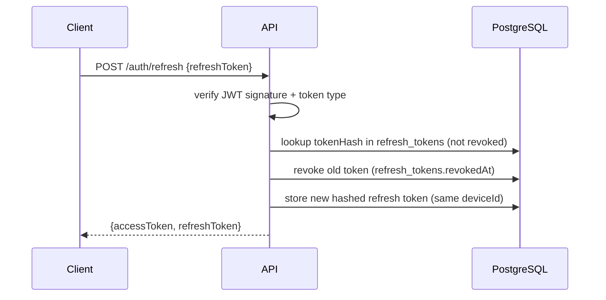

# Security

## 1. Password authentication

```mermaid
sequenceDiagram
    participant C as Client
    participant API as API
    participant DB as PostgreSQL

    C->>API: POST /auth/login {emailOrPhone, password}
    API->>DB: find admin by email OR account by email/phone
    API->>API: bcrypt.compare(password, passwordHash)
    API->>API: reject if status != ACTIVE (blocked/suspended/pending)
    alt 2FA disabled
        API->>DB: create device row; store hashed refresh token (deviceId)
        API-->>C: {accessToken (15m), refreshToken, activeShopId, shops[]}
    else 2FA enabled
        API->>API: create challenge (10 min expiry, max attempts)
        API-->>C: {twoFactorRequired, challengeToken, methods[], expiresAt}
    end
```

- Passwords hashed with **bcryptjs** (cost 12; `BCRYPT_ROUNDS`).
- Password reset always returns `{accepted: true}` (no account enumeration); reset tokens hashed, 30-min expiry; successful reset revokes all refresh tokens.
- Change-password revokes all sessions.

## 2. JWT & refresh rotation



- Access token: 15 min (`JWT_ACCESS_TTL=15m`), carries `{id, actorType, accountId?, membershipId?, activeShopId?, role, permissions?}`.
- Refresh tokens are **hashed at rest** (`tokenHash`), bound to a device, revocable per device (`DELETE /auth/devices/:id`) or all devices (`logout {allDevices:true}`).
- Access tokens are stateless and short-lived; they cannot be revoked individually — keep TTL short.

## 3. 2FA challenge flow

```mermaid
sequenceDiagram
    participant C as Client
    participant API as API
    participant DB as PostgreSQL

    C->>API: POST /auth/login {emailOrPhone, password}
    API-->>C: {twoFactorRequired: true, challengeToken, methods: [AUTHENTICATOR, SMS]}
    C->>API: POST /auth/2fa/challenge/send {challengeToken, method: SMS}
    API->>DB: store hashed OTP in verification_tokens (attempts, 10 min expiry)
    API->>API: enqueue SMS/email
    C->>API: POST /auth/2fa/challenge/verify {challengeToken, method: AUTHENTICATOR, code}
    API->>API: verify TOTP (otplib) or OTP code; consume challenge
    API-->>C: {accessToken, refreshToken, activeShopId, shops[]}
```

- TOTP secrets **encrypted** at rest (`TWO_FACTOR_TOTP_ENCRYPTION_KEY`).
- Backup codes: SHA-256 hashed, single-use; regenerated via `POST /auth/2fa/backup-codes/regenerate`.
- Challenges expire after 10 minutes with a max attempt count; failures are rate-limited and audit-logged.
- Management: `GET /2fa/status`, `PATCH /2fa/methods`, `POST /2fa/authenticator/setup|verify`.

## 4. RBAC matrices

### 4.1 Platform admin roles (`/api/v1/admin/*`)

| Capability | SUPER_ADMIN | ADMIN | SUPPORT_EXECUTIVE | FINANCE_MANAGER | READ_ONLY_AUDITOR |
|---|:---:|:---:|:---:|:---:|:---:|
| Dashboard read | ✓ | ✓ | ✓ | ✓ | ✓ |
| Create/update shops | ✓ | ✓ | — | — | — |
| Suspend/block/activate shops | ✓ | ✓ | request only | — | — |
| Delete shops | ✓ | — | — | — | — |
| User management | ✓ | ✓ | limited | — | read |
| Reset passwords | ✓ | ✓ | ✓ | — | — |
| Subscription management | ✓ | ✓ | — | ✓ | read |
| Finance dashboard | ✓ | read | — | ✓ | read |
| Approval decisions | ✓ | ✓ | — | subscription only | read |
| Support tickets | ✓ | ✓ | ✓ | — | read |
| Notifications | ✓ | ✓ | support templates only | payment templates only | read |
| Reports/export | ✓ | ✓ | ticket reports | finance reports | read/export |
| Audit logs | ✓ | read | — | finance actions only | read/export |
| Platform settings | ✓ | — | — | — | — |
| Security settings | ✓ | — | — | — | read |

Admin permission keys (used in code, e.g. `requirePermission("shops.suspend")`):
`dashboard.read`, `shops.read|create|update|suspend|block|activate|delete`, `users.read|create|update|suspend|block|reset_password`, `subscriptions.read|create|update|delete|assign`, `finance.read|export`, `payments.read|retry`, `approvals.read|approve|reject|request_modification`, `support.read|create|assign|resolve|close`, `notifications.read|create|send`, `reports.read|export`, `audit.read|export`, `settings.read|update`, `security.read|update`, `devices.manage`, `login_history.read`.

### 4.2 Shop permission model (token `activeShopId` + `shop_memberships`)

Role defaults (membership-level `permissions` JSON can refine):

| Role | Permissions |
|---|---|
| OWNER | `*` (all) |
| MANAGER | SHOP_VIEW, EMPLOYEE_VIEW, INVENTORY_VIEW/CREATE/UPDATE, STOCK_VIEW/ADJUST, CUSTOMER_VIEW/CREATE/UPDATE, ORDER_VIEW/CREATE/UPDATE, INVOICE_VIEW/CREATE, PAYMENT_VIEW/CREATE, ANALYTICS_VIEW |
| CASHIER | CUSTOMER_VIEW/CREATE, ORDER_VIEW/CREATE, INVOICE_VIEW/CREATE, PAYMENT_CREATE |
| ACCOUNTANT | INVOICE_VIEW, PAYMENT_VIEW, FINANCE_VIEW/CREATE/UPDATE, ANALYTICS_VIEW |
| INVENTORY_STAFF | INVENTORY_VIEW/CREATE/UPDATE, STOCK_VIEW/ADJUST |
| STAFF | CUSTOMER_VIEW, ORDER_VIEW, INVENTORY_VIEW |

Endpoint permission map: inventory → `INVENTORY_*`; stock mutations → `STOCK_ADJUST`; customers → `CUSTOMER_*`; orders → `ORDER_*`; invoices/payments → `INVOICE_*`/`PAYMENT_*`; finance → `FINANCE_*`; team → `EMPLOYEE_*`; analytics → `ANALYTICS_VIEW`; shop settings → `SETTINGS_*`. Middleware re-loads the membership on every request — a changed role takes effect immediately.

## 5. Device management

- Fingerprint built from `x-device-id`, `x-device-name`, `x-device-type`, `x-device-platform`, `x-device-browser`, `user-agent`, request IP → stored as **SHA-256 hash** (`devices` table). Raw tokens are never stored.
- Login upserts the device row and binds the refresh token to `deviceId`.
- Refresh rotates the token for the same device; removing a device revokes all its refresh tokens.
- Admins additionally have `admin_trusted_devices`; unknown devices trigger the device-verification challenge before 2FA.
- Every login attempt (success/failure), OTP failure, and device decision is written to audit logs.

## 6. Audit logging

Every write endpoint appends an `audit_logs` row: actor (type/id), action, entityType, entityId, shopId, category, severity, oldValue/newValue, metadata, ipAddress, userAgent. Tracked events include login/logout/2FA/device changes, profile & user management, products/inventory/stock changes, invoices/payments, finance entries, customer changes, approvals, blocks, subscription changes.

Severity defaults: `HIGH` (failed/blocked/deleted actions), `MEDIUM` (password/role/device changes), `INFO` (normal operations). Shop users see only their shop's logs; platform admins can query platform-wide (`GET /api/v1/audit-logs` + filters, `/dashboard` for risk widgets).

## 7. Password policy

- Minimum 8 characters; must include upper/lowercase, digit, and symbol (enforced by Zod).
- bcrypt cost 12; unique salts; no plaintext ever stored or logged.
- Failed logins: per-account + per-IP throttling; suspicious patterns audit-logged.
- Never reuse: reset/change rejects the current password.

## 8. Rate limiting

Stricter limits on sensitive endpoints (per IP, sliding window):

| Endpoint group | Limit |
|---|---|
| `POST /auth/login` | 10 attempts / 5 min per IP |
| `POST /auth/otp/request`, `/auth/forgot-password` | 5 / 10 min per IP |
| `POST /auth/2fa/challenge/*` | 5 / 10 min per challenge token |
| `POST /billing/invoices/:id/sms-link`, reminder endpoints | 20 / hour per shop |
| General API | 300 requests / min per token |

Exceeding returns `429` with `{"error":{"code":"RATE_LIMITED","message":"Too many requests, try again later"}}`.

## 9. Transport & hardening checklist

- TLS everywhere (HTTPS-only ingress in production); Helmet security headers; CORS allowlist via `CORS_ORIGINS`.
- Request IDs on every request for log correlation; structured logs (mask phone/email/financial data).
- Secrets via environment / secrets manager — never committed (see DEPLOYMENT.md production checklist).
- Request body limits; strict Zod validation on params/query/body; no `any` leaks in public API types.
- Financial records use reversals, not hard deletes; business data soft-deleted (`deletedAt`).
- Admin dashboard must use real login + session flow — never a public `NEXT_PUBLIC_ADMIN_TOKEN`.
